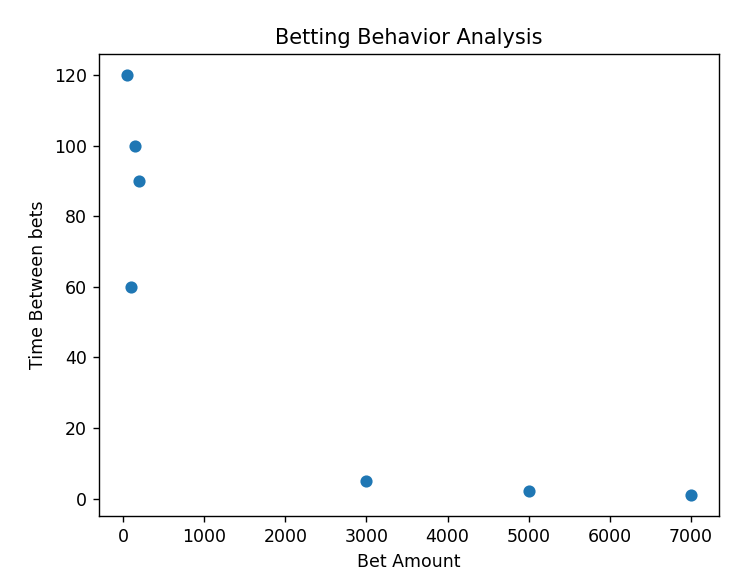

# 🤖 AI Gambling Fraud Detection System

## 📌 Overview

This project detects suspicious betting activity using machine learning.
It simulates real-world sportsbook scenarios and identifies potentially fraudulent bets based on user behavior.

## 💡 Problem

In gambling platforms, users may exploit the system by placing abnormal bets:

* Very high bet amounts
* Very frequent bets
* Unusual odds usage

Detecting such behavior manually is difficult.

## 🧠 Solution

A machine learning model analyzes betting patterns and classifies bets as:

* ✅ Normal
* 🚨 Fraudulent

## ⚙️ Tech Stack

* Python
* Scikit-learn
* FastAPI
* Pandas
* Matplotlib

## 🚀 Features

* Fraud detection using RandomForest model
* REST API built with FastAPI
* Betting behavior visualization
* Simple and scalable architecture

## 📊 Visualization



This graph shows the relationship between bet amount and time between bets.
Fraudulent bets tend to appear as high-amount, low-time clusters.

## ▶️ How to Run

```bash
pip install -r requirements.txt
python model/train_model.py
python analysis/visualize.py
python -m uvicorn api.main:app --reload
```

## 🔍 Example API Request

```
/check?amount=5000&time_between=2&odds=1.5
```

Response:

```
Fraud detected
```

## 📈 Future Improvements

* Add real-time fraud detection
* Introduce user behavior tracking
* Build interactive dashboard
* Improve model accuracy with larger datasets

## 💼 Use Case

This project is relevant for iGaming and sportsbook platforms such as Digitain, where fraud detection and risk analysis are critical.

